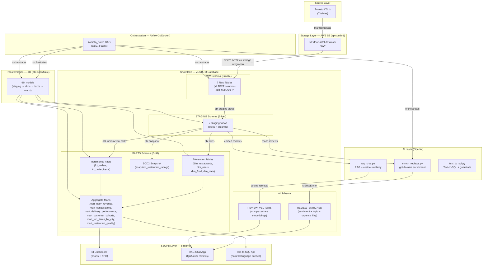
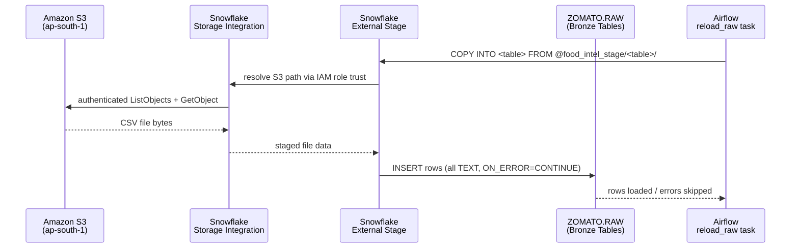
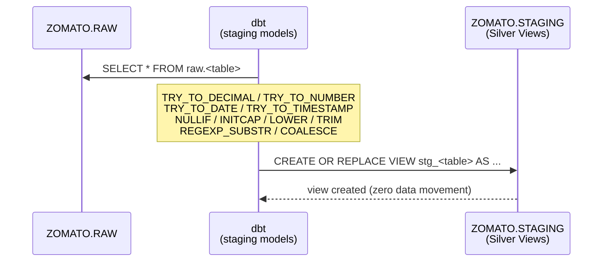
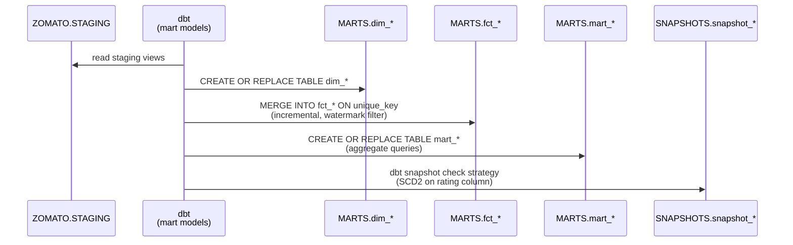
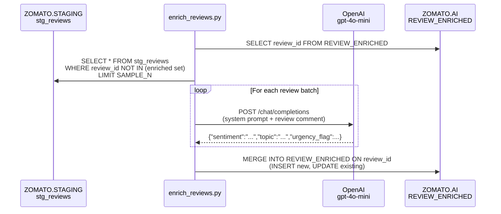
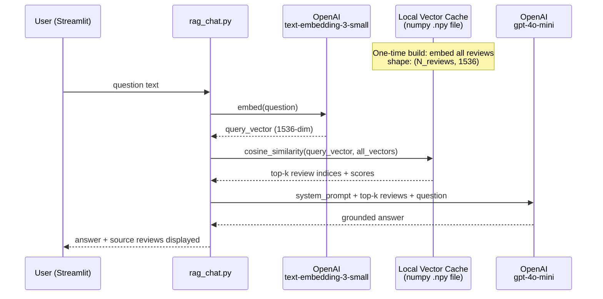
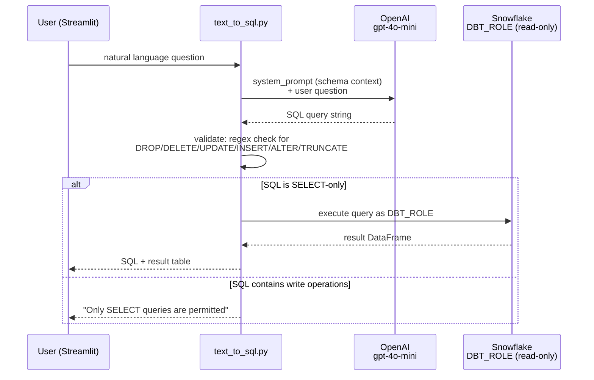
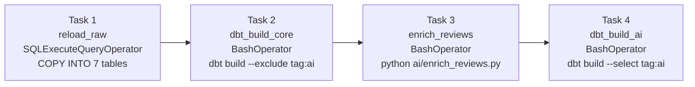
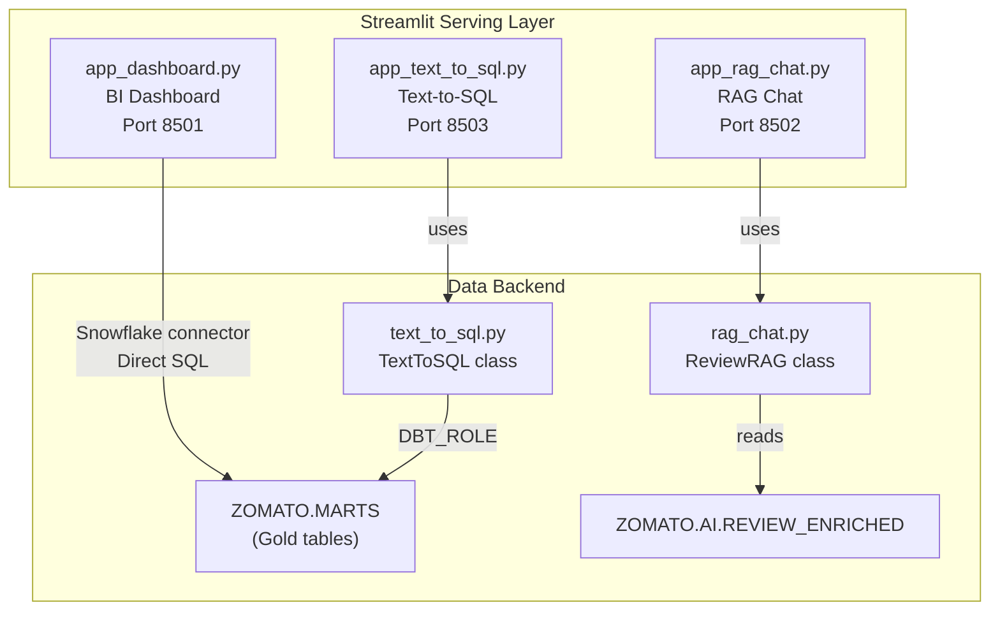

# Design Document: Food-Intel Data Engineering & AI Analytics Platform

## Overview

Food-Intel is an end-to-end batch data engineering platform built on top of a Zomato-style food-delivery dataset. It takes seven raw CSV source tables from Amazon S3 through a full modern data stack — Snowflake (medallion architecture), dbt (Bronze → Silver → Gold transformations), Apache Airflow 3 (orchestration), an AI layer (LLM enrichment + RAG + text-to-SQL), and three Streamlit self-serve applications — producing a production-grade, portfolio-quality data platform.

The platform implements the medallion architecture strictly: raw landing (Bronze), clean typed views (Silver), and analytics-ready marts (Gold), with an orthogonal AI schema for enriched intelligence. All secrets are managed via environment variables, all infrastructure access uses least-privilege IAM and Snowflake roles, and every pipeline task is idempotent and restartable.

This document covers the complete technical design: system architecture, data flow per layer, Snowflake object hierarchy, dbt project structure, Airflow DAG, AI component designs, serving layer, security model, repository layout, and key algorithms.

---

## Architecture

### High-Level Component Diagram



### End-to-End Pipeline Flow

```
Zomato CSVs
  │
  ▼ (manual upload or CI script)
Amazon S3  s3://food-intel-datalake/raw/<table>/YYYY-MM-DD/
  │
  ▼ Task 1: reload_raw  (Airflow → SQLExecuteQueryOperator)
Snowflake RAW schema  — COPY INTO from external stage
  │
  ▼ Task 2: dbt_build_core  (Airflow → BashOperator)
  ├── STAGING schema  — 7 staging views (type cast + clean)
  ├── MARTS schema    — dims + incremental facts + aggregate marts
  └── SNAP            — SCD2 snapshot on restaurant ratings
  │
  ▼ Task 3: enrich_reviews  (Airflow → BashOperator)
AI schema  — REVIEW_ENRICHED populated via gpt-4o-mini
  │
  ▼ Task 4: dbt_build_ai  (Airflow → BashOperator)
AI schema  — dbt models tagged:ai (downstream AI mart models)
  │
  ▼ (on-demand, served from Streamlit)
Streamlit Apps  — BI Dashboard / RAG Chat / Text-to-SQL
```

### Data Flow Diagrams

#### Bronze Layer — S3 to Snowflake RAW



**Key decisions:**
- `ON_ERROR = CONTINUE` — bad rows are skipped, not pipeline-blocking; error file logged to S3
- `ERROR_ON_COLUMN_COUNT_MISMATCH = FALSE` — tolerates schema drift in CSV exports
- All columns land as `TEXT` — no type assumption at this layer
- Keyless access: Snowflake IAM role trusts the Snowflake account, no stored AWS keys

#### Silver Layer — RAW to STAGING



**Key decisions:**
- Materialized as `view` — no storage cost, always reflects latest RAW data
- `TRY_TO_*` functions return NULL on invalid values instead of failing
- String normalization applied at this layer (INITCAP for names, LOWER for emails, TRIM everywhere)

#### Gold Layer — STAGING to MARTS



#### AI Layer — Enrichment Flow



#### AI Layer — RAG Chat Flow



#### AI Layer — Text-to-SQL Flow



### Airflow DAG Task Graph



### DAG Configuration

```python
# zomato_batch.py (structure)
dag = DAG(
    dag_id="zomato_batch",
    schedule="@daily",
    start_date=datetime(2024, 1, 1),
    catchup=False,
    default_args={
        "retries": 2,
        "retry_delay": timedelta(minutes=5),
        "owner": "food-intel",
    },
    tags=["food-intel", "batch"],
)
```

### Task Specifications

| Task ID | Operator | Command / Query | Idempotency Mechanism |
|---------|----------|-----------------|----------------------|
| `reload_raw` | SQLExecuteQueryOperator | `COPY INTO raw.<table> FROM @food_intel_stage/<table>/ ...` × 7 | `COPY INTO` skips already-loaded files (Snowflake load history) |
| `dbt_build_core` | BashOperator | `source /opt/dbt_venv/bin/activate && dbt build --exclude tag:ai` | dbt incremental models use MERGE on unique_key; full-refresh dims are idempotent |
| `enrich_reviews` | BashOperator | `python /opt/airflow/ai/enrich_reviews.py` | MERGE on review_id in REVIEW_ENRICHED; only processes un-enriched rows |
| `dbt_build_ai` | BashOperator | `source /opt/dbt_venv/bin/activate && dbt build --select tag:ai` | Full-refresh mart rebuild from enriched data |

### Docker Compose Services

```yaml
services:
  airflow-webserver:   # Airflow 3 web UI
  airflow-scheduler:   # DAG scheduler
  airflow-worker:      # CeleryExecutor worker (or LocalExecutor for dev)
  postgres:            # Airflow metadata database
  redis:               # CeleryExecutor broker (production)

volumes:
  - ./dags:/opt/airflow/dags
  - ./ai:/opt/airflow/ai
  - ./dbt_project:/opt/airflow/dbt_project
```

### Repository Structure

```
food-intel-data-platform/
├── README.md                          # Project overview + setup guide
├── .gitignore
├── .env.example                       # Template for all required env vars
├── docker-compose.yml                 # Airflow 3 + Postgres + Redis
├── Dockerfile.airflow                 # Airflow image with Python 3.11 + dbt venv
│
├── infra/
│   ├── snowflake_setup.sql            # One-time: db, schemas, roles, warehouse, stage, integration
│   └── iam_policy.json                # AWS IAM policy document
│
├── dags/
│   └── zomato_batch.py                # Main Airflow DAG
│
├── dbt_project/
│   ├── dbt_project.yml
│   ├── packages.yml
│   ├── profiles.yml.example
│   ├── models/
│   │   ├── staging/
│   │   │   ├── _staging.yml
│   │   │   ├── stg_restaurants.sql
│   │   │   ├── stg_users.sql
│   │   │   ├── stg_food.sql
│   │   │   ├── stg_menu.sql
│   │   │   ├── stg_orders.sql
│   │   │   ├── stg_order_items.sql
│   │   │   └── stg_reviews.sql
│   │   ├── marts/
│   │   │   ├── dimensions/
│   │   │   │   ├── dim_restaurants.sql
│   │   │   │   ├── dim_users.sql
│   │   │   │   ├── dim_food.sql
│   │   │   │   └── dim_date.sql
│   │   │   ├── facts/
│   │   │   │   ├── fct_orders.sql
│   │   │   │   └── fct_order_items.sql
│   │   │   └── aggregates/
│   │   │       ├── mart_daily_revenue.sql
│   │   │       ├── mart_cancellations.sql
│   │   │       ├── mart_delivery_performance.sql
│   │   │       ├── mart_customer_cohorts.sql
│   │   │       ├── mart_top_items_by_city.sql
│   │   │       └── mart_restaurant_quality.sql
│   │   └── ai/
│   │       └── mart_review_insights.sql
│   ├── snapshots/
│   │   └── snapshot_restaurant_ratings.sql
│   └── tests/
│       ├── assert_no_order_delivered_before_ordered.sql
│       └── assert_daily_gmv_non_negative.sql
│
├── ai/
│   ├── enrich_reviews.py
│   ├── rag_chat.py
│   ├── text_to_sql.py
│   └── utils/
│       ├── snowflake_client.py        # Snowflake connection factory
│       └── openai_client.py           # OpenAI client factory
│
├── streamlit/
│   ├── app_dashboard.py
│   ├── app_rag_chat.py
│   ├── app_text_to_sql.py
│   └── requirements.txt
│
└── data/                              # gitignored
    ├── review_vectors.npy
    └── review_metadata.json
```

---

## Components and Interfaces

### LLM Enrichment — enrich_reviews.py

**Purpose:** Attach sentiment, topic classification, and urgency flag to every review comment using gpt-4o-mini.

**Interface:**

```python
class ReviewEnricher:
    def __init__(self, snowflake_conn: SnowflakeConnection, openai_client: OpenAI,
                 sample_n: int = 500):
        ...

    def get_unenriched_reviews(self) -> pd.DataFrame:
        """Fetch reviews not yet in REVIEW_ENRICHED. Returns DataFrame."""

    def enrich_batch(self, reviews: pd.DataFrame) -> list[EnrichedReview]:
        """Call gpt-4o-mini for each review. Returns structured results."""

    def upsert_enriched(self, enriched: list[EnrichedReview]) -> None:
        """MERGE INTO REVIEW_ENRICHED on review_id."""

    def run(self) -> None:
        """Orchestrate: fetch → enrich → upsert."""
```

**OpenAI Prompt Design:**

```
System:
  You are a food-delivery review classifier. Given a customer review comment,
  return a JSON object with exactly these fields:
  - sentiment: "positive" | "negative" | "neutral"
  - topic: "delivery" | "food" | "price" | "app" | "service"
  - urgency_flag: true | false  (true if the review indicates an urgent issue
    such as food safety, wrong order, or severe complaint)

  Respond ONLY with valid JSON. No prose.

User:
  Review: "{comment}"
```

**Parameters:**
- Model: `gpt-4o-mini`
- Temperature: `0` (deterministic classification)
- `response_format: { type: "json_object" }`
- Max tokens: 80

**MERGE Pattern (Idempotency):**

```sql
MERGE INTO ZOMATO.AI.REVIEW_ENRICHED AS target
USING (SELECT %s AS review_id, %s AS sentiment, %s AS topic,
              %s AS urgency_flag, %s AS enriched_at) AS source
ON target.review_id = source.review_id
WHEN MATCHED THEN UPDATE SET
    sentiment    = source.sentiment,
    topic        = source.topic,
    urgency_flag = source.urgency_flag,
    enriched_at  = source.enriched_at
WHEN NOT MATCHED THEN INSERT
    (review_id, sentiment, topic, urgency_flag, enriched_at)
    VALUES (source.review_id, source.sentiment, source.topic,
            source.urgency_flag, source.enriched_at);
```

---

### RAG Chat — rag_chat.py

**Purpose:** Allow users to ask natural-language questions answered from review data, grounded in retrieved review excerpts.

**Interface:**

```python
class ReviewRAG:
    def __init__(self, snowflake_conn: SnowflakeConnection, openai_client: OpenAI,
                 vector_cache_path: str = "data/review_vectors.npy",
                 top_k: int = 5):
        ...

    def build_vector_cache(self) -> None:
        """Embed all reviews with text-embedding-3-small. Save to .npy file."""

    def load_vector_cache(self) -> tuple[np.ndarray, list[dict]]:
        """Load cached embeddings + review metadata. Returns (matrix, reviews)."""

    def embed_query(self, question: str) -> np.ndarray:
        """Embed user question. Returns 1536-dim vector."""

    def retrieve(self, query_vector: np.ndarray,
                 all_vectors: np.ndarray,
                 reviews: list[dict]) -> list[dict]:
        """Cosine similarity retrieval. Returns top-k review dicts."""

    def generate_answer(self, question: str, context_reviews: list[dict]) -> str:
        """Generate grounded answer using retrieved reviews as context."""

    def answer(self, question: str) -> tuple[str, list[dict]]:
        """End-to-end: embed → retrieve → generate. Returns (answer, sources)."""
```

**Vector Cache Layout:**

```
data/
├── review_vectors.npy     # shape: (N_reviews, 1536) float32
└── review_metadata.json   # list of {review_id, order_id, comment, rating, review_date}
```

**RAG System Prompt:**

```
System:
  You are a food delivery analytics assistant for Food-Intel.
  Answer the user's question using ONLY the customer reviews provided below.
  If the answer cannot be determined from the reviews, say "I don't have enough
  review data to answer that."
  Cite review IDs when relevant.

  Reviews:
  {formatted_context_reviews}

User:
  {question}
```

**Cosine Similarity Retrieval Algorithm:**

Vectorized cosine similarity over a NumPy matrix — O(N) dot products using BLAS, efficient for up to ~500K reviews on CPU.

```python
import numpy as np

def cosine_similarity_batch(
    query_vector: np.ndarray,    # shape: (1536,)
    matrix: np.ndarray,          # shape: (N, 1536)
    top_k: int = 5
) -> list[int]:
    """
    Returns indices of top-k most similar reviews.

    Algorithm:
    1. Normalize query vector to unit length
    2. Normalize all row vectors to unit length (pre-computed at cache build time)
    3. Dot product → cosine similarity scores (pure matrix multiply)
    4. argsort descending, take first top_k
    """
    # Normalize query
    query_norm = query_vector / (np.linalg.norm(query_vector) + 1e-10)

    # Matrix must be L2-normalised at build time (done once, saved to .npy)
    # scores[i] = cosine_similarity(query, review_i)
    scores = matrix @ query_norm  # shape: (N,)

    # top_k indices in descending order
    top_indices = np.argpartition(scores, -top_k)[-top_k:]
    top_indices = top_indices[np.argsort(scores[top_indices])[::-1]]

    return top_indices.tolist()
```

**Build-time normalization (called once when building cache):**

```python
def build_and_save_cache(reviews: list[dict], embeddings: list[list[float]],
                          path: str) -> None:
    matrix = np.array(embeddings, dtype=np.float32)  # (N, 1536)
    # L2-normalize each row so dot product = cosine similarity
    norms = np.linalg.norm(matrix, axis=1, keepdims=True)
    matrix = matrix / (norms + 1e-10)
    np.save(path, matrix)
```

**Complexity:** O(N × 1536) per query, ~0.5 seconds for N=300K on CPU. Acceptable for Streamlit on-demand use.

---

### Text-to-SQL — text_to_sql.py

**Purpose:** Convert natural language questions to executable SQL against the MARTS schema, with SELECT-only safety guardrails.

**Interface:**

```python
class TextToSQL:
    def __init__(self, snowflake_conn: SnowflakeConnection, openai_client: OpenAI,
                 schema_context: str):
        ...

    def build_schema_context(self) -> str:
        """Read MARTS table/column names from Snowflake information_schema."""

    def generate_sql(self, question: str) -> str:
        """Call gpt-4o-mini with schema context + question. Returns SQL string."""

    def validate_sql(self, sql: str) -> bool:
        """Regex guard: reject any SQL containing write keywords."""

    def execute_sql(self, sql: str) -> pd.DataFrame:
        """Run validated SQL as DBT_ROLE. Returns result DataFrame."""

    def query(self, question: str) -> tuple[str, pd.DataFrame]:
        """End-to-end: generate → validate → execute. Returns (sql, df)."""
```

**Schema Context Injection (System Prompt):**

```
System:
  You are a SQL expert for a food-delivery analytics warehouse.
  Generate a single valid Snowflake SQL SELECT query to answer the user's question.
  Use ONLY tables and columns from the schema below. Do NOT use tables outside this list.
  Return only the SQL query — no explanations, no markdown fences.

  Schema:
  -- MARTS.DIM_RESTAURANTS: id, name, city, cuisine, rating, cost_for_two
  -- MARTS.DIM_USERS: user_id, name, age, gender, city, occupation, monthly_income
  -- MARTS.DIM_FOOD: f_id, item_name, veg_or_non_veg
  -- MARTS.DIM_DATE: date_day, year, month, day_of_week, is_weekend
  -- MARTS.FCT_ORDERS: order_id, ordered_at, user_id, restaurant_id, cuisine,
  --                   sales_amount, discount, delivery_fee, order_status,
  --                   delivery_time_min, customer_rating
  -- MARTS.FCT_ORDER_ITEMS: order_item_id, order_id, restaurant_id, food_id,
  --                        quantity, price, line_amount
  -- MARTS.MART_DAILY_REVENUE: revenue_date, city, cuisine, total_gmv,
  --                            avg_order_value, order_count
  -- MARTS.MART_CANCELLATIONS: city, order_hour, restaurant_id, cancel_rate
  -- MARTS.MART_DELIVERY_PERFORMANCE: city, cuisine, median_delivery_min,
  --                                   p90_delivery_min
  -- MARTS.MART_TOP_ITEMS_BY_CITY: city, food_id, item_name, order_count, revenue
  -- MARTS.MART_RESTAURANT_QUALITY: restaurant_id, name, avg_rating,
  --                                 review_count, total_revenue
```

**SELECT-Only Guard:**

```python
WRITE_KEYWORDS = re.compile(
    r'\b(INSERT|UPDATE|DELETE|DROP|ALTER|TRUNCATE|CREATE|MERGE|REPLACE)\b',
    re.IGNORECASE
)

def validate_sql(self, sql: str) -> bool:
    return not bool(WRITE_KEYWORDS.search(sql))
```

**Dual Guardrail Summary:**

| Guardrail | Type | Implementation |
|-----------|------|----------------|
| Keyword filter | Application-level | Regex on generated SQL before execution |
| Role restriction | Database-level | Connection uses DBT_ROLE (SELECT-only grants) |

---

### Serving Layer — Streamlit Applications



#### BI Dashboard — app_dashboard.py

| Section | Data Source | Chart Type |
|---------|-------------|-----------|
| Revenue Overview | mart_daily_revenue | Line chart — GMV over time |
| City Performance | mart_daily_revenue | Bar chart — GMV by city |
| Cuisine Breakdown | mart_daily_revenue | Pie / treemap |
| Cancellation Heatmap | mart_cancellations | Heatmap (city × hour) |
| Delivery Performance | mart_delivery_performance | Box / violin (median + p90) |
| Top Menu Items | mart_top_items_by_city | Horizontal bar per city |
| Restaurant Quality | mart_restaurant_quality | Scatter (rating vs revenue) |
| Customer Cohorts | mart_customer_cohorts | Retention heatmap |
| Review Sentiment | REVIEW_ENRICHED | Donut + urgency count |

**Key components:**
- Snowflake connector via `snowflake-connector-python`
- `st.cache_data(ttl=3600)` on all query functions
- Date range filter in sidebar
- City multiselect filter

#### RAG Chat App — app_rag_chat.py

**UX Flow:**

```
1. User types question in st.chat_input
2. App calls ReviewRAG.answer(question)
3. Displays streamed answer in st.chat_message("assistant")
4. Shows expandable "Source Reviews" with review_id + comment + rating
5. Chat history maintained in st.session_state
```

**Key components:**
- `@st.cache_resource` to load ReviewRAG once per session (heavy vector matrix)
- Lazy build: check if `review_vectors.npy` exists; if not, call `build_vector_cache()`
- Source citations shown as `st.expander("📖 Source Reviews")`

#### Text-to-SQL App — app_text_to_sql.py

**UX Flow:**

```
1. User types natural language question in st.text_input
2. App calls TextToSQL.query(question)
3. Displays generated SQL in st.code(sql, language="sql")
4. Displays result table in st.dataframe(df)
5. Download button: st.download_button (CSV export)
6. If validation fails: st.error("Only SELECT queries permitted.")
```

**Key components:**
- Schema context built once at startup via `@st.cache_resource`
- Result row limit: `LIMIT 1000` appended if not present in generated SQL

---

### dbt Project Structure

#### Directory Layout

```
dbt_project/
├── dbt_project.yml
├── profiles.yml.example          # never commit profiles.yml
├── packages.yml                  # dbt-utils, dbt-expectations
│
├── models/
│   ├── staging/
│   │   ├── _staging.yml          # sources + staging model docs
│   │   ├── stg_restaurants.sql
│   │   ├── stg_users.sql
│   │   ├── stg_food.sql
│   │   ├── stg_menu.sql
│   │   ├── stg_orders.sql
│   │   ├── stg_order_items.sql
│   │   └── stg_reviews.sql
│   │
│   ├── marts/
│   │   ├── dimensions/
│   │   │   ├── _dimensions.yml
│   │   │   ├── dim_restaurants.sql
│   │   │   ├── dim_users.sql
│   │   │   ├── dim_food.sql
│   │   │   └── dim_date.sql
│   │   │
│   │   ├── facts/
│   │   │   ├── _facts.yml
│   │   │   ├── fct_orders.sql
│   │   │   └── fct_order_items.sql
│   │   │
│   │   └── aggregates/
│   │       ├── _aggregates.yml
│   │       ├── mart_daily_revenue.sql
│   │       ├── mart_cancellations.sql
│   │       ├── mart_delivery_performance.sql
│   │       ├── mart_customer_cohorts.sql
│   │       ├── mart_top_items_by_city.sql
│   │       └── mart_restaurant_quality.sql
│   │
│   └── ai/                       # tag: ai
│       ├── _ai.yml
│       └── mart_review_insights.sql
│
├── snapshots/
│   └── snapshot_restaurant_ratings.sql
│
├── tests/
│   ├── assert_no_order_delivered_before_ordered.sql
│   └── assert_daily_gmv_non_negative.sql
│
├── macros/
│   ├── generate_date_spine.sql
│   └── safe_divide.sql
│
└── seeds/
    └── (none — all data from RAW)
```

#### Model Materialization Summary

| Model | Layer | Materialization | Unique Key / Strategy |
|-------|-------|-----------------|----------------------|
| stg_restaurants | Staging | view | — |
| stg_users | Staging | view | — |
| stg_food | Staging | view | — |
| stg_menu | Staging | view | — |
| stg_orders | Staging | view | — |
| stg_order_items | Staging | view | — |
| stg_reviews | Staging | view | — |
| dim_restaurants | Marts/dims | table | — full refresh |
| dim_users | Marts/dims | table | — full refresh |
| dim_food | Marts/dims | table | — full refresh |
| dim_date | Marts/dims | table | — date spine, full refresh |
| fct_orders | Marts/facts | incremental | order_id, watermark: ordered_at |
| fct_order_items | Marts/facts | incremental | order_item_id |
| mart_daily_revenue | Marts/agg | table | — full refresh |
| mart_cancellations | Marts/agg | table | — full refresh |
| mart_delivery_performance | Marts/agg | table | — full refresh |
| mart_customer_cohorts | Marts/agg | table | — full refresh |
| mart_top_items_by_city | Marts/agg | table | — full refresh |
| mart_restaurant_quality | Marts/agg | table | — full refresh |
| snapshot_restaurant_ratings | Snapshots | snapshot | id, check strategy on rating |
| mart_review_insights (AI) | AI | table | tag: ai |

---

## Data Models

### Snowflake Object Hierarchy

```
ZOMATO (database)
├── RAW (schema) — Bronze layer
│   ├── RESTAURANTS          TEXT columns, append-only
│   ├── USERS                TEXT columns, append-only
│   ├── FOOD                 TEXT columns, append-only
│   ├── MENU                 TEXT columns, append-only
│   ├── ORDERS               TEXT columns, append-only
│   ├── ORDER_ITEMS          TEXT columns, append-only
│   └── REVIEWS              TEXT columns, append-only
│
├── STAGING (schema) — Silver layer
│   ├── STG_RESTAURANTS      VIEW — typed + cleaned
│   ├── STG_USERS            VIEW — typed + cleaned
│   ├── STG_FOOD             VIEW — typed + cleaned
│   ├── STG_MENU             VIEW — typed + cleaned
│   ├── STG_ORDERS           VIEW — typed + cleaned
│   ├── STG_ORDER_ITEMS      VIEW — typed + cleaned
│   └── STG_REVIEWS          VIEW — typed + cleaned
│
├── MARTS (schema) — Gold layer
│   ├── DIM_RESTAURANTS      TABLE — dimension (full refresh)
│   ├── DIM_USERS            TABLE — dimension (full refresh)
│   ├── DIM_FOOD             TABLE — dimension (full refresh)
│   ├── DIM_DATE             TABLE — date spine 2023-01-01 → 2025-12-31
│   ├── FCT_ORDERS           TABLE — incremental (unique_key: order_id)
│   ├── FCT_ORDER_ITEMS      TABLE — incremental (unique_key: order_item_id)
│   ├── MART_DAILY_REVENUE   TABLE — aggregate mart (full refresh)
│   ├── MART_CANCELLATIONS   TABLE — aggregate mart (full refresh)
│   ├── MART_DELIVERY_PERFORMANCE  TABLE — aggregate mart (full refresh)
│   ├── MART_CUSTOMER_COHORTS      TABLE — aggregate mart (full refresh)
│   ├── MART_TOP_ITEMS_BY_CITY     TABLE — aggregate mart (full refresh)
│   └── MART_RESTAURANT_QUALITY   TABLE — aggregate mart (full refresh)
│
├── SNAPSHOTS (schema) — SCD2 layer
│   └── SNAPSHOT_RESTAURANT_RATINGS  TABLE — dbt SCD2 snapshot
│
└── AI (schema) — AI enrichment layer
    ├── REVIEW_ENRICHED      TABLE — LLM sentiment/topic/urgency
    └── REVIEW_VECTORS       TABLE (optional) — embedding cache metadata

FOOD_INTEL_WH (virtual warehouse)
├── Size: X-SMALL for dbt/loading
└── Auto-suspend: 60s

Roles:
├── SYSADMIN       — creates objects
├── DBT_ROLE       — USAGE on ZOMATO db, all schemas; SELECT/INSERT/UPDATE/DELETE on MARTS + AI; SELECT on RAW + STAGING
└── AIRFLOW_ROLE   — USAGE on warehouse; can run COPY INTO; delegates to DBT_ROLE for dbt tasks

Storage Integration: FOOD_INTEL_S3_INTEGRATION
└── TYPE = EXTERNAL_STAGE, STORAGE_PROVIDER = S3, STORAGE_ALLOWED_LOCATIONS = s3://food-intel-datalake/
```

### Table DDL — AI Schema

```sql
CREATE TABLE IF NOT EXISTS ZOMATO.AI.REVIEW_ENRICHED (
    review_id       VARCHAR(50)   PRIMARY KEY,
    sentiment       VARCHAR(10)   NOT NULL,  -- positive/negative/neutral
    topic           VARCHAR(20)   NOT NULL,  -- delivery/food/price/app/service
    urgency_flag    BOOLEAN       NOT NULL,
    enriched_at     TIMESTAMP_NTZ NOT NULL
);
```

### Data Model — LLM Enrichment Output

```python
@dataclass
class EnrichedReview:
    review_id: str
    sentiment: Literal["positive", "negative", "neutral"]
    topic: Literal["delivery", "food", "price", "app", "service"]
    urgency_flag: bool
    enriched_at: datetime
```

### Key Mart SQL Patterns

**Incremental MERGE Logic (fct_orders):**

```sql
-- fct_orders.sql
{{
  config(
    materialized = 'incremental',
    unique_key    = 'order_id',
    on_schema_change = 'fail'
  )
}}

WITH source AS (
    SELECT
        order_id,
        order_timestamp::TIMESTAMP_NTZ  AS ordered_at,
        TRY_TO_DATE(order_date)         AS order_date,
        user_id::INTEGER                AS user_id,
        r_id::INTEGER                   AS restaurant_id,
        restaurant_city                 AS city,
        LOWER(TRIM(cuisine))            AS cuisine,
        items_count::INTEGER            AS items_count,
        TRY_TO_DECIMAL(sales_amount, 18, 2) AS sales_amount,
        TRY_TO_DECIMAL(discount, 18, 2) AS discount,
        TRY_TO_DECIMAL(delivery_fee,18,2) AS delivery_fee,
        TRY_TO_DECIMAL(gst, 18, 2)      AS gst,
        LOWER(TRIM(order_status))       AS order_status,
        customer_rating::INTEGER        AS customer_rating,
        delivery_time_min::INTEGER      AS delivery_time_min
    FROM {{ ref('stg_orders') }}

    
        WHERE order_timestamp::TIMESTAMP_NTZ > (
            SELECT COALESCE(MAX(ordered_at), '1900-01-01'::TIMESTAMP_NTZ)
            FROM {{ this }}
        )
    
)

SELECT * FROM source
```

**MERGE behavior (dbt Snowflake adapter):**
```sql
MERGE INTO MARTS.FCT_ORDERS AS target
USING (SELECT ...) AS source
ON target.order_id = source.order_id
WHEN MATCHED THEN UPDATE SET ...
WHEN NOT MATCHED THEN INSERT ...
```

**Date Spine SQL (dim_date):**

```sql
-- dim_date.sql
{{
  config(materialized = 'table')
}}

WITH date_spine AS (
    SELECT
        DATEADD(
            'day',
            SEQ4(),
            '2023-01-01'::DATE
        ) AS date_day
    FROM TABLE(GENERATOR(ROWCOUNT => 1096))  -- 3 years = 1096 days
    QUALIFY date_day <= '2025-12-31'::DATE
)

SELECT
    date_day,
    YEAR(date_day)                              AS year,
    MONTH(date_day)                             AS month,
    DAY(date_day)                               AS day_of_month,
    DAYOFWEEK(date_day)                         AS day_of_week,    -- 0=Mon, 6=Sun
    DAYNAME(date_day)                           AS day_name,
    QUARTER(date_day)                           AS quarter,
    WEEKOFYEAR(date_day)                        AS week_of_year,
    CASE WHEN DAYOFWEEK(date_day) IN (5, 6)
         THEN TRUE ELSE FALSE END               AS is_weekend,
    TO_CHAR(date_day, 'YYYY-MM')                AS year_month,
    TO_CHAR(date_day, 'YYYY-"Q"Q')             AS year_quarter
FROM date_spine
```

**Cancellation Rate (mart_cancellations):**
```sql
SELECT
    city,
    DATE_PART('hour', ordered_at)  AS order_hour,
    restaurant_id,
    COUNT_IF(order_status = 'cancelled')           AS cancelled_count,
    COUNT(*)                                       AS total_count,
    DIV0(cancelled_count, total_count)             AS cancel_rate
FROM {{ ref('fct_orders') }}
GROUP BY 1, 2, 3
```

**P90 Delivery Time (mart_delivery_performance):**
```sql
SELECT
    city,
    cuisine,
    PERCENTILE_CONT(0.5) WITHIN GROUP (ORDER BY delivery_time_min) AS median_delivery_min,
    PERCENTILE_CONT(0.9) WITHIN GROUP (ORDER BY delivery_time_min) AS p90_delivery_min
FROM {{ ref('fct_orders') }}
WHERE order_status = 'delivered'
  AND delivery_time_min IS NOT NULL
GROUP BY 1, 2
```

**Customer Cohort Retention (mart_customer_cohorts):**
```sql
WITH cohorts AS (
    SELECT
        u.user_id,
        DATE_TRUNC('month', MIN(o.ordered_at)) AS cohort_month
    FROM {{ ref('fct_orders') }} o
    JOIN {{ ref('dim_users') }} u ON o.user_id = u.user_id
    GROUP BY 1
),
activity AS (
    SELECT
        o.user_id,
        DATE_TRUNC('month', o.ordered_at) AS activity_month
    FROM {{ ref('fct_orders') }} o
    GROUP BY 1, 2
)
SELECT
    c.cohort_month,
    DATEDIFF('month', c.cohort_month, a.activity_month) AS months_since_signup,
    COUNT(DISTINCT a.user_id)                           AS retained_users
FROM cohorts c
JOIN activity a ON c.user_id = a.user_id
GROUP BY 1, 2
```

**Top Items by City (mart_top_items_by_city):**
```sql
SELECT
    o.city,
    oi.food_id,
    f.item_name,
    f.veg_or_non_veg,
    SUM(oi.quantity)     AS total_quantity,
    COUNT(*)             AS order_line_count,
    SUM(oi.line_amount)  AS total_revenue
FROM {{ ref('fct_order_items') }} oi
JOIN {{ ref('fct_orders') }} o   ON oi.order_id = o.order_id
JOIN {{ ref('dim_food') }} f     ON oi.food_id  = f.f_id
GROUP BY 1, 2, 3, 4
QUALIFY ROW_NUMBER() OVER (PARTITION BY city ORDER BY total_quantity DESC) <= 20
```

### SCD2 Snapshot (dbt)

Tracks historical changes to restaurant ratings using dbt's snapshot mechanism with `check` strategy.

```sql
-- snapshots/snapshot_restaurant_ratings.sql


{{
    config(
      target_schema  = 'snapshots',
      unique_key     = 'id',
      strategy       = 'check',
      check_cols     = ['rating'],
      invalidate_hard_deletes = True
    )
}}

SELECT
    id,
    name,
    city,
    rating::DECIMAL(3,1)     AS rating,
    rating_count::INTEGER    AS rating_count
FROM {{ ref('stg_restaurants') }}


```

**SCD2 columns added by dbt:**
- `dbt_scd_id` — surrogate key for each SCD2 record
- `dbt_updated_at` — when the record was last seen
- `dbt_valid_from` — when this version became active
- `dbt_valid_to` — when this version was superseded (NULL = current)

### Security Model

#### AWS IAM

```
IAM Policy: food-intel-s3-policy
  Effect: Allow
  Actions: [s3:GetObject, s3:ListBucket, s3:GetBucketLocation]
  Resource: [arn:aws:s3:::food-intel-datalake, arn:aws:s3:::food-intel-datalake/*]

IAM Role: food-intel-snowflake-role
  Trust Policy: {
    "Principal": {"AWS": "arn:aws:iam::<snowflake_account_id>:root"},
    "Condition": {"StringEquals": {"sts:ExternalId": "<snowflake_external_id>"}}
  }
  Attached Policy: food-intel-s3-policy
```

**No stored AWS keys anywhere in code or config.**

#### Snowflake Role Hierarchy

```
SYSADMIN
  └─ creates: ZOMATO database, all schemas, warehouse, storage integration

DBT_ROLE
  ├─ USAGE ON DATABASE ZOMATO
  ├─ USAGE ON SCHEMA ZOMATO.{RAW, STAGING, MARTS, SNAPSHOTS, AI}
  ├─ SELECT ON ALL TABLES IN SCHEMA ZOMATO.RAW
  ├─ SELECT ON ALL TABLES IN SCHEMA ZOMATO.STAGING
  ├─ SELECT, INSERT, UPDATE, DELETE ON ALL TABLES IN SCHEMA ZOMATO.MARTS
  ├─ SELECT, INSERT, UPDATE, DELETE ON ALL TABLES IN SCHEMA ZOMATO.SNAPSHOTS
  ├─ SELECT, INSERT, UPDATE, DELETE ON ALL TABLES IN SCHEMA ZOMATO.AI
  └─ USAGE ON WAREHOUSE FOOD_INTEL_WH

AIRFLOW_ROLE
  ├─ USAGE ON DATABASE ZOMATO
  ├─ USAGE ON SCHEMA ZOMATO.RAW
  ├─ INSERT ON ALL TABLES IN SCHEMA ZOMATO.RAW  (for COPY INTO)
  └─ USAGE ON WAREHOUSE FOOD_INTEL_WH

Streamlit apps connect as DBT_ROLE → read-only effective due to SELECT-only guard + role grants
Text-to-SQL app connects as DBT_ROLE → no write access possible at the role level
```

#### Secrets Management

| Secret | Storage Location | How Referenced |
|--------|-----------------|----------------|
| `SNOWFLAKE_ACCOUNT` | Environment variable | `os.environ["SNOWFLAKE_ACCOUNT"]` |
| `SNOWFLAKE_USER` | Environment variable | `os.environ["SNOWFLAKE_USER"]` |
| `SNOWFLAKE_PASSWORD` | Environment variable | `os.environ["SNOWFLAKE_PASSWORD"]` |
| `SNOWFLAKE_ROLE` | Environment variable | `os.environ["SNOWFLAKE_ROLE"]` |
| `SNOWFLAKE_WAREHOUSE` | Environment variable | `os.environ["SNOWFLAKE_WAREHOUSE"]` |
| `SNOWFLAKE_DATABASE` | Environment variable | `os.environ["SNOWFLAKE_DATABASE"]` |
| `OPENAI_API_KEY` | Environment variable | `os.environ["OPENAI_API_KEY"]` |
| AWS credentials | IAM Role trust (keyless) | No env var needed |

**.gitignore must include:**
```
.env
profiles.yml
*.npy
data/
```

---

## Correctness Properties

### Property 1: Pipeline Idempotency

- Every pipeline run with the same input data must produce the same output — running the DAG twice on the same day must not duplicate rows in any table.
- `COPY INTO` skips files already present in Snowflake's load history; re-running `reload_raw` never inserts duplicate raw rows.
- dbt incremental models MERGE on `unique_key`; a re-run updates existing rows and inserts only new ones.
- `REVIEW_ENRICHED` is populated via MERGE on `review_id`; duplicate enrichment calls update in-place rather than appending.

### Property 2: Data Quality Invariants

- Every `fct_orders.order_id` is unique and non-null (enforced by dbt `unique` + `not_null` generic tests).
- No order has `delivered_at < ordered_at` (enforced by singular test `assert_no_order_delivered_before_ordered`).
- No aggregate mart row has `total_gmv < 0` (enforced by singular test `assert_daily_gmv_non_negative`).
- `order_status` is always one of `['delivered', 'cancelled', 'pending']` (dbt `accepted_values` test).
- `fct_orders.user_id` always resolves to a valid `dim_users.user_id` (dbt `relationships` test).
- `stg_reviews.rating` is always in `[1, 2, 3, 4, 5]` (dbt `accepted_values` test).

### Property 3: AI Output Format Guarantees

- Every LLM enrichment response is valid JSON containing exactly the fields `sentiment`, `topic`, and `urgency_flag`; the prompt uses `response_format: { type: "json_object" }` and `temperature: 0` to enforce this.
- `sentiment` is always one of `["positive", "negative", "neutral"]`.
- `topic` is always one of `["delivery", "food", "price", "app", "service"]`.
- `urgency_flag` is always a boolean.

### Property 4: SQL Safety Guarantee

- The text-to-SQL component never executes a write statement: the application-layer regex guard rejects any SQL containing write/DDL keywords (`INSERT`, `UPDATE`, `DELETE`, `DROP`, `ALTER`, `TRUNCATE`, `CREATE`, `MERGE`, `REPLACE`, `UPSERT`, `GRANT`, `REVOKE`, `CALL`, `EXECUTE`).
- A second, independent guardrail — the DBT_ROLE database role — has no write grants on any table, so even a bypassed regex cannot modify data.

### Property 5: SCD2 Correctness

- For any restaurant, at most one snapshot record has `dbt_valid_to IS NULL` (current active record).
- Historical records preserve the rating value as it existed at `dbt_valid_from`, ensuring time-travel queries return accurate past ratings.

### Property 6: Vector Cache Consistency

- The `review_vectors.npy` matrix rows are L2-normalized at build time; cosine similarity is therefore equivalent to a dot product, meaning retrieval scores are always in `[-1, 1]`.
- The index of row `i` in the matrix corresponds to row `i` in `review_metadata.json`; these files are always built and saved atomically in the same `build_vector_cache()` call.

---

## Error Handling

### COPY INTO Failures (Bronze Layer)

**Condition:** A CSV file contains malformed rows (wrong column count, invalid characters, encoding issues).

**Response:** `ON_ERROR = CONTINUE` in the COPY INTO statement skips the bad row and continues loading the remainder of the file. `ERROR_ON_COLUMN_COUNT_MISMATCH = FALSE` prevents column-count drift from aborting the load entirely.

**Recovery:** The Snowflake `COPY_HISTORY` table records skipped row counts and error details for each load operation. A downstream data quality check in dbt (`not_null`, `accepted_values`) will surface rows that made it through with NULL values from failed `TRY_TO_*` casts. Bad rows do not block the pipeline; they are flagged for investigation.

### dbt Test Failures (Silver / Gold Layers)

**Condition:** A dbt generic test (`unique`, `not_null`, `relationships`, `accepted_values`) or a singular test (`assert_no_order_delivered_before_ordered`, `assert_daily_gmv_non_negative`) fails.

**Response:** `dbt build` exits with a non-zero return code. The Airflow BashOperator marks the `dbt_build_core` or `dbt_build_ai` task as **failed**, halting the downstream tasks in the DAG.

**Recovery:** Airflow retries the task up to 2 times with a 5-minute delay (`retries: 2`, `retry_delay: timedelta(minutes=5)`). If all retries are exhausted, the DAG run is marked failed and the on-call engineer is alerted. The previous day's Gold layer tables remain intact because dbt incremental models only MERGE new rows; failed runs do not corrupt existing data.

### OpenAI API Failures (AI Enrichment Layer)

**Condition:** The OpenAI API returns a rate-limit error (HTTP 429), a timeout, or a malformed JSON response from the LLM.

**Response:** `enrich_reviews.py` implements exponential backoff with jitter for 429/5xx responses. If a single review's JSON response cannot be parsed, that review is skipped and logged; the batch continues. At the end of the run, the number of successfully enriched vs. skipped reviews is logged.

**Recovery:** Because enrichment uses a MERGE pattern keyed on `review_id`, any skipped reviews remain in the "unenriched" pool and will be picked up on the next DAG run. No data is lost. If the entire API is unreachable, the Airflow task fails and retries per the DAG retry policy.

### Text-to-SQL Guard Rejection

**Condition:** The LLM generates a SQL statement that contains write/DDL keywords (`INSERT`, `DROP`, `ALTER`, etc.).

**Response:** `validate_sql()` returns `False`. The Streamlit app displays `st.error("Only SELECT queries are permitted.")` and does not execute the query against Snowflake.

**Recovery:** The user is prompted to rephrase their question. No database state is affected. A secondary guardrail at the database layer (DBT_ROLE has no write grants) ensures that even if the application-layer guard were bypassed, no write could succeed.

### RAG Vector Cache Missing

**Condition:** `review_vectors.npy` does not exist on first startup, or the file is corrupted/deleted.

**Response:** `ReviewRAG` checks for the file at initialization. If absent, it calls `build_vector_cache()` automatically before responding to the first user query.

**Recovery:** Cache rebuild is transparent to the user but takes time proportional to the number of reviews (one embedding API call per review). Progress is logged. If the OpenAI embedding API is unavailable during the rebuild, the error surfaces in the Streamlit app with a user-friendly message.

### Airflow Task Retry Budget Exhausted

**Condition:** A task exceeds its 2-retry budget (e.g., Snowflake is unreachable, dbt fails repeatedly).

**Response:** The DAG run is marked failed. All downstream tasks within the same run are skipped. The previous day's Gold layer data remains available to Streamlit apps.

**Recovery:** The engineer inspects Airflow logs, resolves the root cause, and triggers a manual DAG re-run. Since all tasks are idempotent, a re-run from any point is safe.

---

## Testing Strategy

### Unit Testing — dbt Generic Tests

Defined in `schema.yml` files alongside each model layer. These run as part of every `dbt build` invocation.

```yaml
# fct_orders — schema.yml
- unique: order_id
- not_null: [order_id, ordered_at, user_id, restaurant_id, sales_amount]
- relationships: user_id → dim_users.user_id
- relationships: restaurant_id → dim_restaurants.id
- accepted_values: order_status in ['delivered', 'cancelled', 'pending']
- accepted_values: payment_method in ['cash', 'card', 'upi', 'wallet']

# stg_reviews — schema.yml
- not_null: [review_id, order_id, rating]
- accepted_values: rating in [1, 2, 3, 4, 5]
```

### Singular Tests — Business Logic Assertions

Custom SQL tests in `tests/` that encode business rules not expressible as generic tests. They return rows when the assertion is violated; a non-empty result causes `dbt test` to fail.

```sql
-- assert_no_order_delivered_before_ordered.sql
SELECT order_id
FROM {{ ref('fct_orders') }}
WHERE delivered_at < ordered_at

-- assert_daily_gmv_non_negative.sql
SELECT revenue_date, total_gmv
FROM {{ ref('mart_daily_revenue') }}
WHERE total_gmv < 0
```

### AI Enrichment Validation

**Output format check:** After each batch enrichment call, `enrich_reviews.py` validates the parsed JSON against the expected schema before upserting. Any response missing required keys or containing out-of-vocabulary values is logged and skipped.

**Idempotency spot-check:** Re-running enrichment on already-enriched reviews must produce the same `sentiment`, `topic`, and `urgency_flag` values (temperature=0 ensures determinism). This can be verified by comparing `REVIEW_ENRICHED` row counts before and after a second enrichment pass — the count must not increase.

**Coverage check:** After each enrichment run, log `SELECT COUNT(*) FROM stg_reviews WHERE review_id NOT IN (SELECT review_id FROM REVIEW_ENRICHED)` to track how many reviews remain unenriched.

### Text-to-SQL Guard Testing

**Blocklist coverage:** The regex `WRITE_PATTERN` should be exercised against a set of known-dangerous SQL strings to confirm all write/DDL keywords are rejected:

```python
dangerous_inputs = [
    "INSERT INTO fct_orders VALUES (...)",
    "DROP TABLE mart_daily_revenue",
    "ALTER TABLE dim_users ADD COLUMN ...",
    "UPDATE fct_orders SET sales_amount = 0",
    "TRUNCATE TABLE REVIEW_ENRICHED",
    "CREATE TABLE hacked AS SELECT ...",
    "MERGE INTO fct_orders ...",
    "GRANT ALL ON SCHEMA MARTS TO PUBLIC",
]
# All must return is_safe_select(...) == False
```

**Passthrough coverage:** Valid SELECT queries must not be blocked:

```python
safe_inputs = [
    "SELECT * FROM mart_daily_revenue LIMIT 10",
    "SELECT city, SUM(total_gmv) FROM mart_daily_revenue GROUP BY city",
    "SELECT order_id FROM fct_orders WHERE order_status = 'cancelled'",
]
# All must return is_safe_select(...) == True
```

### Integration Testing — End-to-End Pipeline

Run the full `zomato_batch` DAG against a Snowflake development database populated with a small representative slice of the Zomato CSV data. Assert:

1. After `reload_raw`: row counts in all 7 RAW tables are non-zero.
2. After `dbt_build_core`: all dbt generic and singular tests pass with zero failures.
3. After `enrich_reviews`: `REVIEW_ENRICHED` contains at least one row with valid `sentiment`, `topic`, and `urgency_flag` values.
4. After `dbt_build_ai`: `mart_review_insights` is populated with at least one row.

---

## Dependencies

### Python Packages

| Package | Version (pinned) | Purpose |
|---------|-----------------|---------|
| `apache-airflow` | 3.x | Pipeline orchestration |
| `dbt-snowflake` | latest stable | dbt adapter for Snowflake |
| `snowflake-connector-python` | latest stable | Snowflake Python client |
| `openai` | ≥1.0 | OpenAI API client |
| `numpy` | latest stable | Vector cache + cosine similarity |
| `pandas` | latest stable | DataFrame operations in AI scripts |
| `streamlit` | latest stable | Serving layer UI |

### Infrastructure

| Service | Version / Tier | Purpose |
|---------|---------------|---------|
| Amazon S3 | Standard (ap-south-1) | Raw data landing zone |
| Snowflake | Standard edition | Data warehouse (all layers) |
| Airflow | 3.x (Docker) | Batch orchestration |
| OpenAI API | gpt-4o-mini, text-embedding-3-small | LLM enrichment + embeddings |

### dbt Packages

```yaml
# packages.yml
packages:
  - package: dbt-labs/dbt_utils
    version: [">=1.0.0"]
  - package: calogica/dbt_expectations
    version: [">=0.10.0"]
```

---

## Appendix: Key Design Decisions

| Decision | Choice | Rationale |
|----------|--------|-----------|
| All RAW columns as TEXT | TEXT landing | Decouple ingestion from schema evolution; fail-safe for CSV drift |
| Staging as VIEW | No materialization cost | Silver layer adds no storage; always reflects latest Bronze |
| Incremental with watermark | `MAX(ordered_at)` filter | Efficient daily loads; avoids full table scan on 10M rows |
| Cosine similarity in numpy | Local vector cache | No external vector DB dependency; 300K reviews fits in memory (~1.8GB float32) |
| DBT_ROLE for all app connections | Least privilege | No app can escalate to write; safe for Streamlit exposure |
| Airflow dbt in separate venv | `/opt/dbt_venv` | dbt and Airflow have conflicting dependency trees (click version) |
| `ON_ERROR = CONTINUE` in COPY INTO | Skip bad rows | Prefer partial load over pipeline failure for raw CSV data |
| temperature=0 for LLM enrichment | Deterministic output | Classification tasks need consistency; not creative tasks |
| `QUALIFY ROW_NUMBER()` in mart_top_items | Window function filter | Native Snowflake idiom; cleaner than subquery for top-N per partition |
