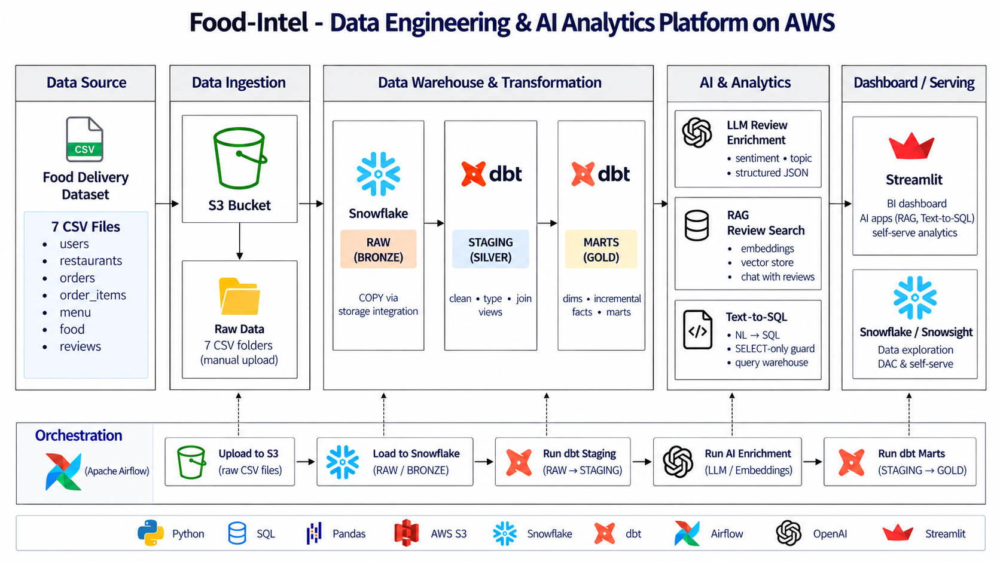

# Food-Intel — Data Engineering & AI Analytics Platform

> **From raw CSVs to an AI-powered warehouse** — a complete modern data stack built on a food-delivery dataset.


<!--  
[](https://python.org)
[](https://getdbt.com)
[](https://airflow.apache.org)
[](https://snowflake.com)
[](https://openai.com)
[](https://streamlit.io)
-->
---

## What This Project Builds

An end-to-end batch data pipeline that takes 7 raw CSV files through a full modern data stack:

```
Food-Delivery CSVs → Amazon S3 → Snowflake (Bronze→Silver→Gold) → dbt → Airflow → AI Layer → Streamlit
```

**Three AI capabilities on top of the warehouse:**
- 🤖 **LLM Enrichment** — GPT-4o-mini classifies every review into sentiment + topic + urgency flag
- 💬 **RAG Chat** — Ask questions, get answers grounded in real customer reviews
- 🔍 **Text-to-SQL** — Type plain English, get live Snowflake query results

---

## Tech Stack

| Layer | Tool |
|-------|------|
| Storage | Amazon S3 (ap-south-1) |
| Warehouse | Snowflake |
| Transformation | dbt (dbt-snowflake) |
| Orchestration | Apache Airflow 3 on Docker |
| AI / LLM | OpenAI GPT-4o-mini + text-embedding-3-small |
| Serving | Streamlit |
| Language | Python 3.11+ |

---

## Dataset

| Table | Description | Volume |
|-------|-------------|--------|
| orders | Core fact — status, amounts, times | 10M rows |
| order_items | Line items per order | 23M rows |
| reviews | Free-text comments + ratings | 300K rows |
| restaurants | Who sells — cuisine, city, rating | Dimension |
| users | Who orders — city, signup date | Dimension |
| food | Menu items — veg/non-veg | Dimension |
| menu | Restaurant × food × price | Dimension |

> 📦 Dataset is not committed to this repo (2.3 GB). Download from the [Google Drive folder](#) and place files under `Data/`.

---

## Architecture

### Medallion Layers

```
RAW (Bronze)     — All columns as TEXT, append-only, tolerant COPY INTO
STAGING (Silver) — Typed + cleaned dbt views (TRY_TO_DECIMAL, NULLIF, INITCAP)
MARTS (Gold)     — Dims, incremental facts, aggregate marts
AI               — LLM-enriched review table (REVIEW_ENRICHED)
```

### Airflow DAG — 4 Tasks

```
reload_raw → dbt_build_core → enrich_reviews → dbt_build_ai
```

| Task | What it does |
|------|-------------|
| `reload_raw` | COPY INTO all 7 RAW tables from S3 |
| `dbt_build_core` | Build + test all models except AI tag |
| `enrich_reviews` | Call GPT-4o-mini on un-enriched reviews |
| `dbt_build_ai` | Build AI marts on enriched data |

---

## Repository Structure

```
food-intel-data-platform/
├── dags/
│   └── zomato_batch.py          # Airflow DAG (4 tasks, daily)
├── dbt_project/
│   ├── models/
│   │   ├── staging/             # 7 staging views (Silver)
│   │   ├── marts/
│   │   │   ├── dimensions/      # dim_restaurants, dim_users, dim_food, dim_date
│   │   │   ├── facts/           # fct_orders (incremental), fct_order_items
│   │   │   └── aggregates/      # 6 business marts
│   │   └── ai/                  # mart_review_insights (tag:ai)
│   └── snapshots/               # SCD2 on restaurant ratings
├── ai/
│   ├── enrich_reviews.py        # LLM enrichment → REVIEW_ENRICHED
│   ├── rag_chat.py              # RAG chat with reviews
│   └── text_to_sql.py           # Natural language → Snowflake SQL
├── streamlit/
│   ├── app_dashboard.py         # BI dashboard
│   ├── app_rag_chat.py          # RAG chat app
│   └── app_text_to_sql.py       # Text-to-SQL app
├── infra/
│   ├── snowflake_setup.sql      # One-time Snowflake setup
│   └── iam_policy.json          # AWS IAM policy
├── Doc/
│   └── Architecture.png
├── docker-compose.yml
├── Dockerfile.airflow
├── .env.example
└── README.md
```

---

## Setup Guide

### Prerequisites

- AWS account with S3 access
- Snowflake account (free trial works)
- Docker Desktop installed
- Python 3.11+
- OpenAI API key

---

### Step 1 — Clone the repo

```bash
git clone https://github.com/<your-username>/food-intel-data-platform.git
cd food-intel-data-platform
```

---

### Step 2 — Set up environment variables

```bash
cp .env.example .env
```

Edit `.env` and fill in your values:

```env
# Snowflake
SNOWFLAKE_ACCOUNT=your_account
SNOWFLAKE_USER=your_user
SNOWFLAKE_PASSWORD=your_password
SNOWFLAKE_DATABASE=ZOMATO
SNOWFLAKE_WAREHOUSE=FOOD_INTEL_WH
SNOWFLAKE_ROLE=DBT_ROLE

# AWS
AWS_DEFAULT_REGION=ap-south-1
S3_BUCKET=food-intel-datalake

# OpenAI
OPENAI_API_KEY=sk-...
```

---

### Step 3 — Set up Snowflake

Run these SQL files **in order** in Snowsight (Snowflake UI):

```
infra/snowflake_setup.sql     # Creates warehouse, database, schemas, roles
```

---

### Step 4 — Upload data to S3

```bash
# Upload all CSVs to S3
aws s3 sync Data/ s3://food-intel-datalake/raw/
```

---

### Step 5 — Set up dbt

```bash
cd dbt_project
pip install dbt-snowflake
cp profiles.yml.example ~/.dbt/profiles.yml
# Edit ~/.dbt/profiles.yml with your Snowflake credentials

# Test connection
dbt debug

# Run all models
dbt build
```

---

### Step 6 — Start Airflow with Docker

```bash
# From project root
docker compose up --build -d

# Open Airflow UI
# http://localhost:8080
# Username: airflow | Password: airflow
```

Add the Snowflake connection in Airflow UI:
- **Conn ID:** `snowflake_default`
- **Conn Type:** Snowflake
- Fill in your account, user, password, database, warehouse, role

Trigger the DAG: `zomato_batch`

---

### Step 7 — Run AI enrichment manually (optional)

```bash
cd ai
pip install -r requirements.txt
python enrich_reviews.py --sample-n 500
```

---

### Step 8 — Launch Streamlit apps

```bash
cd streamlit
pip install -r requirements.txt

# BI Dashboard
streamlit run app_dashboard.py

# RAG Chat (open new terminal)
streamlit run app_rag_chat.py

# Text-to-SQL (open new terminal)
streamlit run app_text_to_sql.py
```

---

## dbt Models

### Run commands

```bash
# Build everything
dbt build

# Build only staging
dbt build --select staging

# Build only AI models
dbt build --select tag:ai

# Full refresh incremental models
dbt build --full-refresh --select fct_orders

# Run tests only
dbt test

# Generate + serve docs
dbt docs generate && dbt docs serve
```

---

## What Makes This Unique

| Feature | This Project | Reference Project |
|---------|-------------|-------------------|
| LLM enrichment fields | sentiment + topic + **urgency_flag** | sentiment + topic only |
| Extra Gold mart | **mart_top_items_by_city** | Not present |
| SCD2 snapshot | **Restaurant ratings history** | Not present |
| AWS region | **ap-south-1 (Mumbai)** | us-east-1 |
| Airflow version | **Airflow 3** | Airflow 2.9 |

---

## Security

- ✅ No AWS keys stored — keyless S3 access via IAM role trust
- ✅ dbt runs as `DBT_ROLE`, not ACCOUNTADMIN
- ✅ Text-to-SQL uses SELECT-only guard + DBT_ROLE (read-only)
- ✅ All secrets in environment variables, never in code
- ✅ `.env` is in `.gitignore`

---

## Skills Demonstrated

`AWS S3` · `Snowflake` · `dbt` · `Apache Airflow` · `Docker` · `OpenAI API` · `RAG` · `Text-to-SQL` · `Medallion Architecture` · `Incremental Models` · `SCD2 Snapshots` · `ELT Pipeline` · `Streamlit` · `Python` · `SQL`

---

## License

MIT License — free to use, modify, and share.

---

*Built as a portfolio data engineering project. Inspired by the Zomato AI Data Engineering curriculum.*